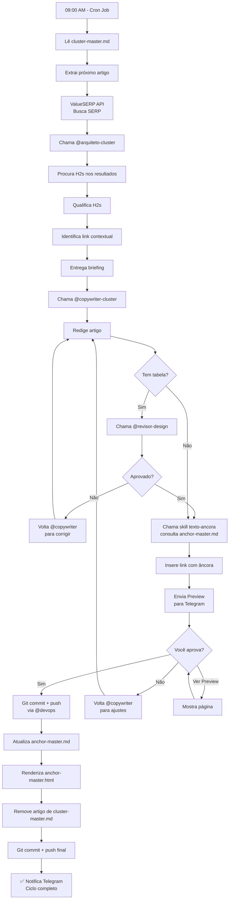

# Fluxo de Automação - Cluster Daily Architect

## 🎯 Objetivo
Processo totalmente automatizado que, **diariamente**:
1. Pega 1 artigo do `cluster-master.md`
2. Arquiteta (H2s, links, estrutura)
3. Escreve (redação completa)
4. Publica (git commit + push)
5. Atualiza files de controle
6. Remove artigo do master

**Sem precisar de aprovação manual no terminal** — tudo automático.

---

## 📋 Arquivos de Entrada/Saída

### Input
- `squads/squad-oportunidades/file/cluster-master.md`
  - Lista de artigos a fazer
  - Estrutura: Money Page > Posts de Suporte
  - Cada post tem: título, URL (slug), links para

### Output/Atualização
- `squads/squad-oportunidades/file/anchor-master.md`
  - Histórico de âncoras usadas
  - Saldo de links por tipo (target/brand/misc)
  - Nunca repetir âncora exata

- `squads/squad-oportunidades/file/anchor-master.html`
  - Versão HTML renderizada do anchor-master
  - Usado para visualização rápida

- `cluster-master.md` → **REMOVER artigo após publicar**

---

## 🔄 Fluxo Automático Diário

### PASSO 1 — Extração do Artigo (9:00 AM)
```
Script roda diariamente às 9:00 AM

1. Lê cluster-master.md
2. Identifica próximo artigo NÃO PROCESSADO
3. Extrai:
   - Título do post
   - URL (slug)
   - Money page (pillar) relacionada
   - Links para (quais páginas lincar)
```

### PASSO 2 — Arquitetura (automático)
```
Chama @arquiteto-cluster internamente:

Input:
- Keyword do artigo
- Pillar relacionada
- Nicho

Output:
- H2s estruturados (mínimo 5)
- Link contextual identificado (qual H2)
- Briefing pronto

A skill texto-ancora CONSULTA anchor-master.md:
- Verifica âncoras já usadas naquela página de destino
- Sugere variações novas (nunca repetir exata)
- Respeita quotas: target (50%), brand (25%), misc (25%)
```

### PASSO 2.5 — Busca SERP com ValueSERP (automático)
```
Usa API ValueSERP em vez de busca manual:

1. Script faz chamada:
   GET https://api.valueserp.com/search
   ?q=[keyword do artigo]
   &api_key=[VALUESERP_API_KEY]

2. Extrai dados:
   - Top 3 URLs dos resultados
   - Passa para @arquiteto-cluster

Configuração:
export VALUESERP_API_KEY="seu-token-valueserp"
```

### PASSO 3 — Redação (automático)
```
Chama @copywriter-cluster internamente:

Input:
- Briefing do arquiteto
- anchor-master.md (para referência de âncoras)

Output:
- Artigo completo (700-2000 palavras)
- Com link contextual incluído
- Âncora já escolhida (via texto-ancora)

Skill texto-ancora É OBRIGATÓRIA:
- Define exatamente qual será o texto da âncora
- Registra em variável de ambiente para update do anchor-master depois

⚠️ DETECTOR DE TABELAS:
- Se artigo contém <table> ou markdown table
- Chama @revisor-design para validação
- Aguarda aprovação antes de continuar
```

### PASSO 3.5 — Revisão de Design (se houver tabelas)
```
Se o artigo tem tabela(s):

1. Script detecta tags <table> ou markdown |---|
2. Chama @revisor-design:
   - Passa HTML/Markdown da tabela
   - Valida formatação conforme padrão do site

3. @revisor-design retorna:
   - ✅ Aprovado → continua fluxo
   - ❌ Rejeição → volta para @copywriter-cluster corrigir
   - Sugestões de ajuste

4. Se rejeitado, @copywriter-cluster refaz tabela
5. Script reexecuta detecção até aprovado
```

### PASSO 4 — Aprovação no Telegram (com preview)
```
Script envia para Telegram:

1. Texto:
   🎯 Pronto para publicar!

   Título: [título do artigo]
   URL: /[slug]/
   Palavras: [contagem]
   Tabelas: [sim/não]
   Links internos: [quantidade]

2. Botões inline:
   ✅ Aprovar e Publicar
   👁️ Ver Preview
   ❌ Rejeitar (volta para edição)

3. Se clicar "Ver Preview":
   - Renderiza página .astro
   - Envia screenshot ou link
   - Volta para botões de aprovação

4. Aguarda sua aprovação indefinidamente
   - Se ✅ → continua PASSO 5
   - Se ❌ → retorna ao @copywriter-cluster com observações
   - Se 👁️ → mostra preview e volta
```

### PASSO 5 — Publicação (após aprovação)
```
APÓS VOCÊ APROVAR NO TELEGRAM:

1. Cria arquivo: src/pages/[slug].astro
2. Faz git commit:
   feat: publica artigo cluster '[titulo]' + atualiza anchor-master
3. Faz git push (via @devops)
4. Aguarda push completar
5. Envia Telegram: ✅ Publicado!
```

### PASSO 5 — Atualização de Files (automático)
```
1. Lê anchor-master.md
2. Localiza seção da página que recebeu link
3. Adiciona nova entrada ao histórico:
   | /artigo-novo/ | [âncora usada] | [tipo] | [data] |
4. Atualiza saldo:
   - Target usados: +1
   - Brand usados: +1 (se Brand foi usado)
   - Etc...
5. Atualiza anchor-master.html (renderizar versão legível)
6. Faz git commit: docs: atualiza anchor-master após publicação
```

### PASSO 6 — Limpeza (automático)
```
1. Lê cluster-master.md
2. Remove entrada do artigo publicado
3. Faz git commit: docs: remove artigo publicado de cluster-master
4. Faz git push
```

---

## 🔗 Integração com Skill Texto-Ancora

### Quando é chamada
Dentro do @copywriter-cluster, **antes de escrever** o parágrafo com o link:

```javascript
const anchorText = await executeSkillTextoAncora({
  targetPage: '/melhores-maquininhas-cartao/',
  context: 'Se você quer comparar todas as opções...',
  anchor-master: conteudo_do_arquivo, // Passa referência
  type: 'target' // ou 'brand' ou 'misc'
});
```

### O que faz
1. **Consulta anchor-master.md:**
   - Quais âncoras já foram usadas para esta página de destino?
   - Quais tipos de âncora ainda têm saldo disponível?

2. **Gera sugestões:**
   - Sempre variações NOVAS
   - Nunca repete âncora exata
   - Respeita quotas

3. **Retorna:**
   ```javascript
   {
     anchorText: "compare todas as maquininhas lado a lado",
     type: "target",
     reason: "Variação de 'maquininhas de cartão' já usada"
   }
   ```

4. **Registra para depois:**
   - Salva em variável de env: `ANCHOR_USED_[PAGE_HASH]`
   - Step 5 do fluxo usa isso para atualizar anchor-master

---

## 🐳 Workflow da Automação (Sequência)



---

## 📝 Estado/Persistência

Script mantém arquivo de estado: `.aiox/cluster-architect-daily-state.json`

```json
{
  "lastRun": "2026-04-15T09:00:00Z",
  "currentArticle": "/vale-refeicao-vale-alimentacao-diferenca/",
  "step": "published",
  "anchorsUsedToday": {
    "/melhores-maquininhas-cartao-voucher/": {
      "anchorText": "compare todas as maquininhas lado a lado",
      "type": "target",
      "timestamp": "2026-04-15T09:45:00Z"
    }
  },
  "processedArticles": [
    "/vale-refeicao-vale-alimentacao-diferenca/",
    "/bandeiras-voucher-brasil/"
  ]
}
```

---

## ⚙️ Configuração na VPS

Após criar o script, na VPS:

```bash
# 1. Adicionar variáveis de ambiente
export TELEGRAM_TOKEN="seu-token-telegram"
export TELEGRAM_CHAT_ID="seu-chat-id"
export GITHUB_TOKEN="seu-github-token" # Para push automático via @devops
export VALUESERP_API_KEY="sua-chave-valueserp" # Para busca SERP

# 2. Configurar cron job
crontab -e
# Roda diariamente às 9:00 AM
0 9 * * * /usr/bin/node /caminho/para/cluster-daily-architect.js >> /var/log/cluster-architect.log 2>&1

# 3. Pronto! Script rodará automaticamente
```

**Credenciais necessárias:**
- `TELEGRAM_TOKEN` — token do bot (já tem)
- `TELEGRAM_CHAT_ID` — chat ID seu (já tem)
- `GITHUB_TOKEN` — token GitHub para git push
- `VALUESERP_API_KEY` — chave da API ValueSERP (https://www.valueserp.com)

---

## 🚨 Falhas/Erros

Se algo der errado:
1. Envia mensagem Telegram alertando
2. Salva estado da falha em `.aiox/cluster-architect-daily-state.json`
3. Na próxima execução, retoma do ponto de falha
4. Nunca pula artigo ou executa duplicado

---

## 📐 ValueSERP API Integration

```javascript
// Chamada simples para buscar SERP
const response = await fetch('https://api.valueserp.com/search', {
  method: 'GET',
  headers: { 'Authorization': `Bearer ${process.env.VALUESERP_API_KEY}` },
  body: new URLSearchParams({
    q: keywordDoArtigo,
    country: 'br',
    language: 'pt',
    page: 1
  })
});

const results = await response.json();
const top3 = results.organic.slice(0, 3); // Pega top 3 URLs

// Passa para @arquiteto-cluster
const briefing = await executeArchitect({
  keyword: keywordDoArtigo,
  serpResults: top3,
  pillarUrl: urlDaPillar
});
```

---

## 🎨 Revisor de Design (@revisor-design)

Chamado **automaticamente** quando detecta tabelas:

```javascript
// Detector de tabelas no HTML do artigo
const hasTable = artigo.includes('<table') || artigo.includes('|---|');

if (hasTable) {
  const review = await executeDesignReview({
    articleHtml: artigo,
    tables: extractTables(artigo),
    site: 'negociocertoorg'
  });

  // Review retorna:
  if (review.status === 'rejected') {
    console.log('❌ Tabelas não estão conforme padrão');
    console.log('Observações:', review.feedback);
    // Volta para @copywriter-cluster corrigir
    // Script reexecuta redação com feedback
  }
}
```

---

## ✅ Checklist de Implementação

Depois de criar o script:

- [ ] Script roda sem erro
- [ ] Lê cluster-master.md corretamente
- [ ] ValueSERP API integrada e busca SERP automaticamente
- [ ] Chama @arquiteto-cluster internamente com resultados da SERP
- [ ] Chama @copywriter-cluster internamente
- [ ] Detector de tabelas ativado
- [ ] Chama @revisor-design quando necessário
- [ ] Skill texto-ancora integrada e consulta anchor-master
- [ ] Envia preview para Telegram antes de publicar
- [ ] Aguarda sua aprovação no Telegram (botões ✅/❌/👁️)
- [ ] Git push funciona via @devops
- [ ] anchor-master.md é atualizado
- [ ] anchor-master.html é gerado
- [ ] Artigo é removido de cluster-master.md
- [ ] Cron job configurado e rodando diariamente às 9:00 AM
